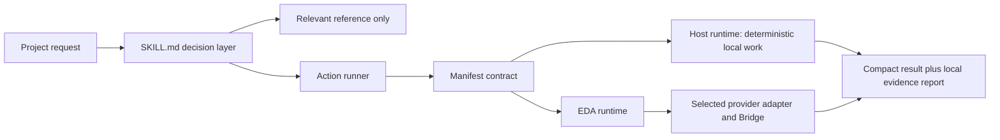

# FlitRealize

[简体中文](README.zh-CN.md)

FlitRealize is an electronics hardware engineering skill that advances a
stateful project from requirements and architecture through schematic, PCB,
prototype ordering, bring-up, and evidence-driven revision.

> Status: **FlitRealize T1** (`v0.1.0-test.7`), the current public test build.
> It is intended for trusted single-user local development and clean-environment
> testing, not as a stable release.

## Scope

FlitRealize is for project-level electronics hardware work, including:

- requirements, architecture, parts, and schematic decisions;
- PCB placement, routing intent, manufacturing review, and EDA automation;
- prototype ordering, safe bring-up, debugging, and revision;
- project-isolated continuation across conversations.

It is not a general software, website, content-creation, or project-management
skill. It also avoids activating for isolated component facts or one-step EDA
questions that need no project state.

## 30-second start

After installation, start with a project-level request such as:

```text
$flitrealize continue this hardware project. Identify the project root and
current evidence first; inspect only until I explicitly authorize a write.
```

FlitRealize will route the task to the relevant hardware reference and reuse a
registered deterministic Action when one fits. EDA writes remain separately
authorization-gated.

## Compatibility

The skill follows the open Agent Skills structure and is tested primarily with
Codex. A host with only chat or read-only tools can still plan and review, while
file, terminal, browser, and EDA tools are required for corresponding actions.
Optional local knowledge catalogs improve continuity but are never required.
Repository tooling requires Node.js 22 or newer and Python 3.

## Install for local Codex use

Place this repository at:

```text
$HOME/.agents/skills/flitrealize
```

Or ask `$skill-installer` to install the skill from the repository URL after the
GitHub remote is published. Invoke it explicitly with `$flitrealize`; Codex may
also select it when a request matches the description. Restart Codex if a newly
installed or renamed skill does not appear.

See the [official OpenAI skill documentation](https://developers.openai.com/codex/skills)
for current discovery and installation behavior. Standalone skills are intended
for local use and experimentation; wider installable distribution can later use
a plugin.

## Repository layout

```text
flitrealize/
├── SKILL.md                 # runtime entrypoint
├── agents/openai.yaml       # Codex UI metadata
├── references/              # runtime references loaded on demand
├── schemas/                 # versioned portable hardware data contracts
├── docs/zh-CN/              # human-readable Chinese mirror
├── scripts/                 # local/EDA actions, provider control, validation, packaging
└── .github/workflows/       # cross-platform validation and tag release automation
```

The release ZIP contains the runtime entrypoint, UI metadata, references,
versioned schematic Contract/Snapshot schemas, the host/EDA Action runner,
host-portable provider control, a provider-free schematic contract audit, and
tested transactional EasyEDA actions for
layer structure, component geometry, functional keepouts, realized copper
pours, grounding inspection, necessary GND vias, and read-only global stitching
planning. Author workspaces, machine
profiles, project records, local catalogs, and optimization history are not part
of the public artifact.

## How the runtime fits together



## Reference map

| Reference | Load it for |
| --- | --- |
| [`stage-gates.md`](references/stage-gates.md) | Entry and exit evidence for each hardware stage |
| [`continuation.md`](references/continuation.md) | Project isolation and continuation across conversations |
| [`schematic-contract.md`](references/schematic-contract.md) | Schematic inputs, outputs, review contracts, and evidence |
| [`easyeda-pro.md`](references/easyeda-pro.md) | EasyEDA Pro, the local Bridge, official APIs, and Action execution |
| [`local-actions.md`](references/local-actions.md) | Local Action contracts, runtime/provider boundaries, and evidence-led evolution |
| [`pcb-review.md`](references/pcb-review.md) | Placement, routing, stackup, grounding, DRC, and manufacturing review |
| [`audio-systems.md`](references/audio-systems.md) | Audio-specific architecture, layout, return paths, and validation |
| [`prototype-validation.md`](references/prototype-validation.md) | Prototype ordering, safe bring-up, and validation planning |
| [`debug-loop.md`](references/debug-loop.md) | Evidence-led diagnosis and revision closure |
| [`production-handoff.md`](references/production-handoff.md) | Manufacturing outputs and production handoff |

## Validate and package

```powershell
python scripts/validate.py
python scripts/package_release.py
npm test
./scripts/release.ps1 -DryRun
# After reviewing and explicitly staging the intended files:
./scripts/release.ps1 -Publish -Message "feat: release FlitRealize T1 v0.1.0-test.7"
```

The package command creates a deterministic ZIP and SHA-256 sidecar under
`dist/`. By default, and with `-DryRun`, the release entrypoint only runs
repository validation, all Node Action tests, deterministic packaging,
version/checksum/tag consistency, a clean-ZIP smoke test, and a staged-addition
secret scan. `-Publish` is the only mutating mode: it requires an explicitly
reviewed staged set, no unstaged or untracked files, a configured remote, and a
commit message; it then commits, creates the version tag, and atomically pushes
the branch and tag. The authorized tag push triggers an independent read-back
validation that rebuilds the deterministic artifact, creates a draft GitHub
Release, uploads the ZIP and SHA-256 sidecar, and publishes only after every
check passes. A retry accepts an already-published release only when both remote
assets exactly match the rebuilt bytes. If an English instruction changes,
update the matching Chinese text and then refresh its source hash with:

```powershell
python scripts/update_translation_hashes.py
```

## License

FlitRealize is released under the [MIT License](LICENSE). Copyright (c) 2026
FlitFancy.
