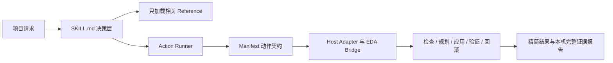

# FlitRealize

[English](README.md)

FlitRealize 是一个电子硬件工程 Skill，用于把有持续状态的项目从需求和架构推进到原理图、PCB、原型下单、安全上电以及证据驱动的改版。

> 当前状态：**FlitRealize T1**（`v0.1.0-test.6`），当前公开测试版本。用于可信单用户本机开发和干净环境测试，尚不是稳定版。

## 适用范围

FlitRealize 专用于项目级电子硬件工作，包括：

- 需求、架构、器件和原理图决策；
- PCB 布局、布线意图、制造评审和 EDA 自动化；
- 原型下单、安全上电、调试和改版；
- 在不同对话之间隔离并续接项目状态。

它不是通用的软件、网站、内容创作或项目管理 Skill，也不会因为孤立器件事实或无需项目状态的一步式 EDA 问题而触发。

## 30 秒开始

安装完成后，可以从一个项目级请求开始：

```text
$flitrealize 继续这个硬件项目。先识别项目根目录和当前证据；在我明确授权写入前只做检查。
```

FlitRealize 会按任务加载相关硬件参考，并在有合适动作时复用已注册的确定性 Action。EDA 写入仍需要单独授权。

## 兼容性

本 Skill 遵循开放的 Agent Skills 结构，并主要在 Codex 中测试。只有聊天或只读工具的宿主仍可规划和评审；相应的文件、终端、浏览器和 EDA 工具齐全时，才能执行对应操作。本地知识 catalog 是可选增强，不是运行前提。
仓库工具链要求 Node.js 22 或更高版本以及 Python 3。

## 在 Codex 本地安装

把本仓库放到：

```text
$HOME/.agents/skills/flitrealize
```

GitHub 远端公开后，也可以让 `$skill-installer` 从仓库地址安装。使用 `$flitrealize` 可显式调用；请求匹配 description 时 Codex 也可以自动选择。新安装或改名后如果没有出现，请重启 Codex。

当前发现和安装行为以 [OpenAI 官方 Skill 文档](https://developers.openai.com/codex/skills) 为准。独立 Skill 适合本地使用和试验；以后需要更广泛的可安装分发时，可以再包装成 Plugin。

## 仓库结构

```text
flitrealize/
├── SKILL.md                 # 运行入口
├── agents/openai.yaml       # Codex 界面元数据
├── references/              # 按需加载的运行参考
├── docs/zh-CN/              # 中文人工阅读镜像
├── scripts/                 # EDA 动作、主机 Adapter 控制、校验与打包
└── .github/workflows/       # 跨平台校验和 Tag 自动发布
```

发布 ZIP 包含运行入口、界面元数据、参考文件、主机可移植的 EDA Adapter 控制，以及针对层结构、器件几何、功能性禁铜、实际铺铜、接地检查、必要 GND 过孔和全局缝合只读规划的已测试动作。作者工作区、机器配置、具体项目记录、本地 catalog 和优化历史不会进入公开制品。

## 运行结构



## Reference 导航

| Reference | 适用内容 |
| --- | --- |
| [`stage-gates.md`](docs/zh-CN/references/stage-gates.md) | 各硬件阶段的进入、退出条件和证据 |
| [`continuation.md`](docs/zh-CN/references/continuation.md) | 项目隔离与跨对话续接 |
| [`schematic-contract.md`](docs/zh-CN/references/schematic-contract.md) | 原理图输入、输出、评审契约和证据 |
| [`easyeda-pro.md`](docs/zh-CN/references/easyeda-pro.md) | EasyEDA Pro、本机 Bridge、官方 API 和 Action 执行 |
| [`pcb-review.md`](docs/zh-CN/references/pcb-review.md) | 布局、布线、层叠、接地、DRC 和制造评审 |
| [`audio-systems.md`](docs/zh-CN/references/audio-systems.md) | 音频专项架构、布局、回流路径和验证 |
| [`prototype-validation.md`](docs/zh-CN/references/prototype-validation.md) | 样机下单、安全上电和验证计划 |
| [`debug-loop.md`](docs/zh-CN/references/debug-loop.md) | 证据驱动的诊断和改版闭环 |
| [`production-handoff.md`](docs/zh-CN/references/production-handoff.md) | 制造输出和生产交接 |

## 校验和打包

```powershell
python scripts/validate.py
python scripts/package_release.py
npm test
./scripts/release.ps1 -DryRun
# 人工复核并明确暂存准备发布的文件后：
./scripts/release.ps1 -Publish -Message "feat: release FlitRealize T1 v0.1.0-test.6"
```

打包命令会在 `dist/` 下生成可复现 ZIP 和 SHA-256 文件。默认模式及 `-DryRun` 只做检查：依次运行仓库校验、全部 Node Action 测试、可复现打包、版本/校验和/Tag 一致性、干净 ZIP 冒烟测试和暂存新增内容密钥扫描。只有 `-Publish` 会修改外部状态；它要求已经人工复核并明确暂存发布文件、工作区不存在未暂存或未跟踪文件、远端已经配置，并提供提交信息，然后才会提交、创建版本 Tag，并原子推送分支和 Tag。这个已经授权的 Tag 推送会触发独立回读校验：重新构建确定性制品、创建 Draft GitHub Release、上传 ZIP 与 SHA-256 文件，并且只有在所有检查通过后才发布。重试遇到已经发布的版本时，只有远端两个制品与本次重建字节完全一致才会成功。英文指令变化后，应同步修改相应中文内容，然后更新来源哈希：

```powershell
python scripts/update_translation_hashes.py
```

## 许可证

FlitRealize 使用 [MIT License](LICENSE) 发布。Copyright (c) 2026 FlitFancy。
